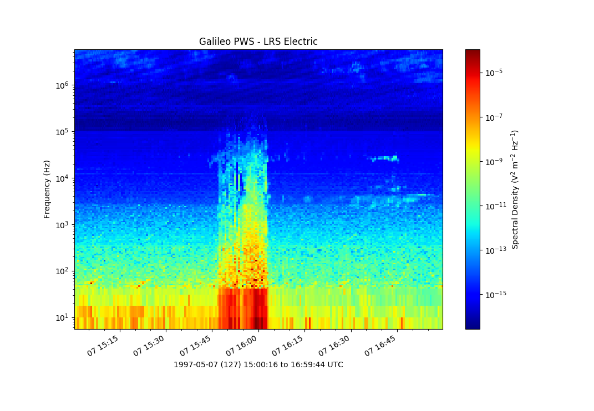

Ex 02: Simple Cubic Spectra
---------------------------
Plotting simple cubic spectra from the Galileo_ PWI_ using pcolormesh_.

	
.. literalinclude:: ../../examples/ex02_galileo_pws_spectra.py
	:linenos:
	:language: python

.. _pcolormesh: https://matplotlib.org/api/_as_gen/matplotlib.pyplot.pcolormesh.html

.. _Galileo: https://www.jpl.nasa.gov/missions/galileo/
.. _PWI: http://space.physics.uiowa.edu/galileo/
