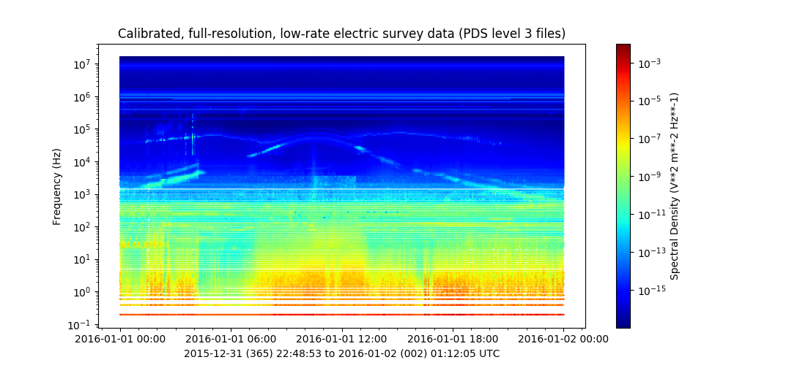

Ex 03: Multimode Spectra
------------------------
Plotting Multimode Spectra using hexbin_

.. literalinclude:: ../../examples/ex03_cassini_rpws_multimode.py
	:linenos:
	:language: python
	
.. _hexbin: https://matplotlib.org/api/_as_gen/matplotlib.pyplot.hexbin.html
