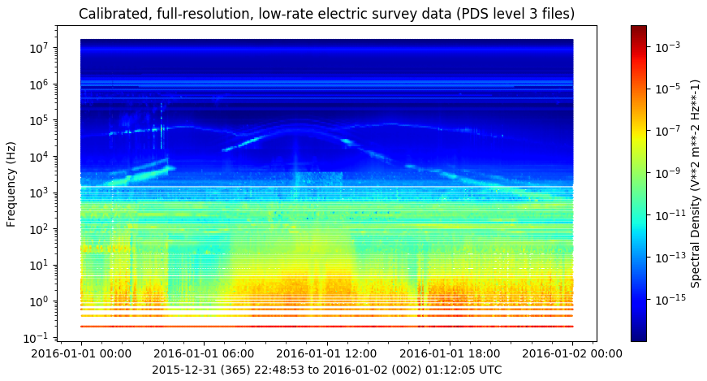
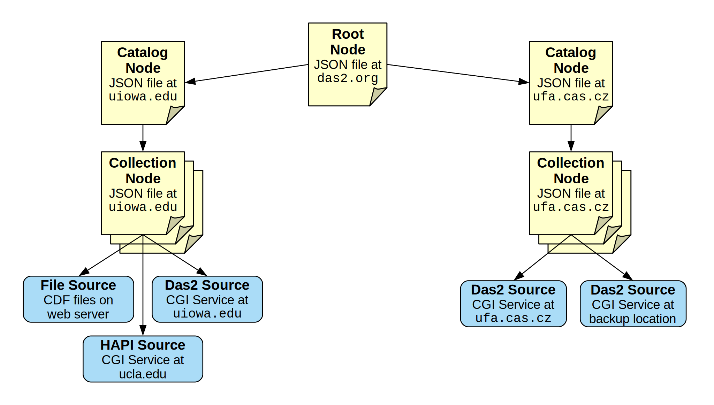
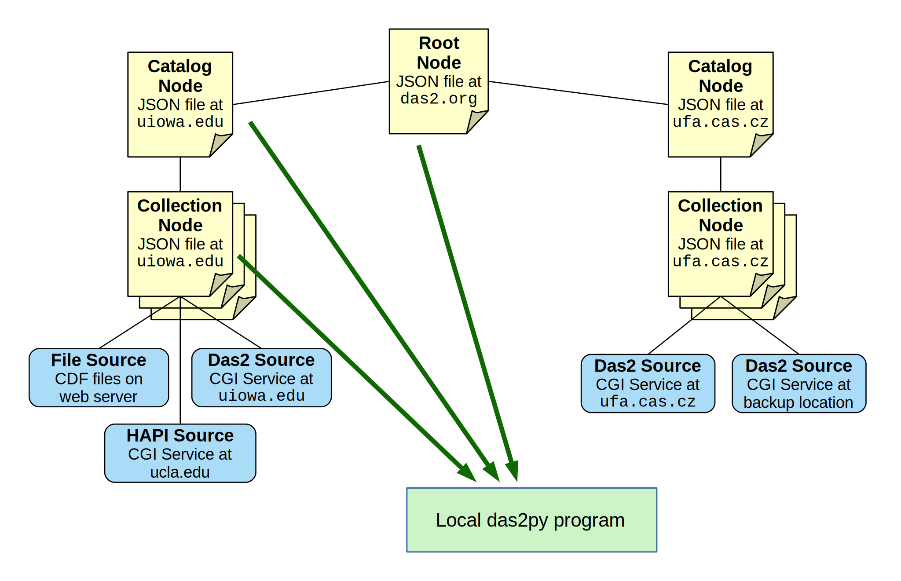

das2py: The python das2 client package
======================================

.. toctree::
	:hidden:
	:maxdepth: 4

	Examples <examples>
	das2 Module Reference <ref_hi>
	_das2 C-extension Reference <ref_lo>

This module builds upon the functionality provided by the C-library, libdas2,
to bring to das2 client capabilities to C-python programs.  Functionality
provided in this package:

	#. Locates data sources across institutions using the
	   `federated das2 data catalog`_.

	#. Converts data sub-set queries into back-end server protocol messages.

	#. Efficently reads data streams to directly into numpy_ arrays.

	#. Assists with generating matplotlib_ plots.

Das2py does not provide any builtin plotting capabilities.  Instead that task
is left to the quite capable matplotlib_ package, or any other plotting
software that can read numpy arrays.  The plot below was generated from
Cassini_ RPWS_ Multimode Electric Survey spectra using das2py to gather the
data and matplotlib_ to render the image.

The complete application code for generating the plot above can be found in
Example 03.

Short Walkthrough
=================

The point of this section is to provide a mental picture of what the software
is upto when various functions are called.  As a frame of reference here's an
example das2 server system configuration.

	Simplified das2 catalog and data services

The *das2* data system is organized using a distributed catalog of static
JSON (`JavaScript Object Notation`_) documents, denoted as yellow pages above.
The cononical root of this hierarchy is the single file at
https://das2.org/catalog/index.json, or one of it's mirrors.
Higher level documents contain URLs that point to lower level documents, thus
providing a catalog hierarchy.  Since absolute URLs are required, catalog nodes
can reside anywhere on the Web.  Static JSON files were selected as the
information infastructure of choice as common institutional IT security policies
often make it difficult to open up software services, such as relational
database systems, to the outside world.  Unlike a software oriented solution,
static files are usually acceptable and easily recovered after a server
malfunction.

The lowest level nodes in the catalog define data source interfaces. In
the diagram above the data source nodes have been left out as these are used
by the das2py Collection object behind the scenes, though it is possible to use
them directly.  Typically the actual data values are provided as das2 streams
served from a das2 server, though work is underway to support more stream
formats as well as static CDF_ files.

Data Source Definitions
-----------------------
Most das2py source code examples start by providing a dota collection ID to
the ``das2.get_source()`` function.  This defines the source inside a local
python object which can then be queried for data.  In the code snippet below
the data source collection for the Electric field Survey data from the Plasma
Wave Instrument that was onboard the Galileo_ spacecraft is aquired::

	import das2
	meta_src = das2.get_source('site:/uiowa/galileo/pws/survey_electic')

When ``get_source()`` is called das2py will access the global catalog and
walk it's nodes until finding the node at the virtual path:
``tag:das2.org,2012:site:/uiowa/galileo/pws/survey_electic`` as illustrated
below.

	Walking the catalog tree to retrieve a data source collection node

Navigation of the federated catalog is handled by a single call.  If a branch
of the catalog happens to be off line, das2py will automatically back up and
try an alternate branch.  This behavior is true all we way up to the root node,
which is duplicated off site for reliability.

Once a data collection definition has been aquired it can be queried for as
subset of the data in a specified coordinate range at a desired resolution.
If you just want example data an don't care which data source provides it or
how the data are sub-set in coordinate space the single call::

	dataset_list = meta_src.get()

will get the job done.  The output of this call is a python list of
das2 ``dataset`` objects.

Installation
============

Todo

Caveat
======
All das2 stream values denoting a time interval (ex: seconds, minutes,
years, etc) are stored as NumPy timedelta64['ns'] objects.  Thus the largest
time difference that can be understood by das2py is about 292 years.  Any
values outside this range are converted to fill.  This limitation can be 
removed in the future if needed by auto selecting NumPy time units based on
the data range and precision.

Indices and tables
==================

* :ref:`genindex`
* :ref:`modindex`
* :ref:`search`

.. _https://das2.org/catalog/index.json: https://das2.org/catalog/index.json
.. _Galileo: https://www.jpl.nasa.gov/missions/galileo/
.. _Cassini: https://solarsystem.nasa.gov/missions/cassini/overview/
.. _RPWS: https://space.physics.uiowa.edu/cassini/
.. _JavaScript Object Notation:  https://www.json.org
.. _federated das2 data catalog: https://das2.org/browse
.. _numpy: https://www.numpy.org
.. _matplotlib: https://matplotlib.org/
.. _CDF: https://cdf.gsfc.nasa.gov/
