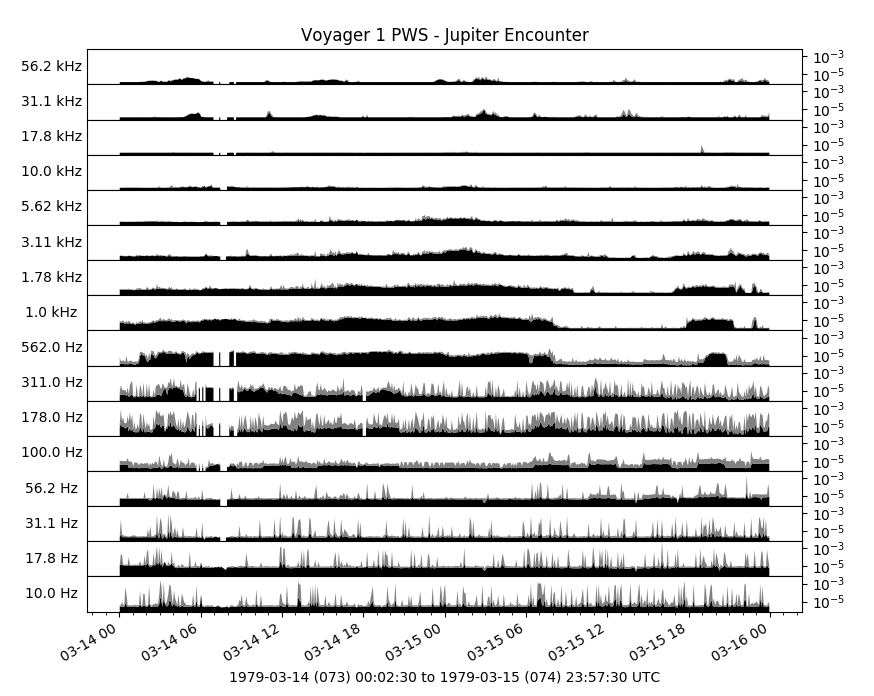

Ex 04: Query by Time
--------------------
This is an example of converting Voyager_ 1 PWS_ waveform data to power spectral
density in client code.

For long time durations it's more efficent to read dynamic spectra directly
from the server, for example this data source: 
`tag\:das2.org,2012:site:/uiowa/voyager/1/pws/uncalibrated/highrate_spectrogram`_,
however dust hit processing must be preformed on the time-series data directly.

.. literalinclude:: ../../examples/ex04_voyager_pws_query_by_time.py
	:linenos:
	:language: python
	

.. _Voyager: https://voyager.jpl.nasa.gov/
.. _PWS: https://space.physics.uiowa.edu/voyager/
.. _tag:das2.org,2012:site:/uiowa/voyager/1/pws/uncalibrated/highrate_spectrogram : https://das2.org/browse/uiowa/voyager/1/pws/uncalibrated/highrate_spectrogram

